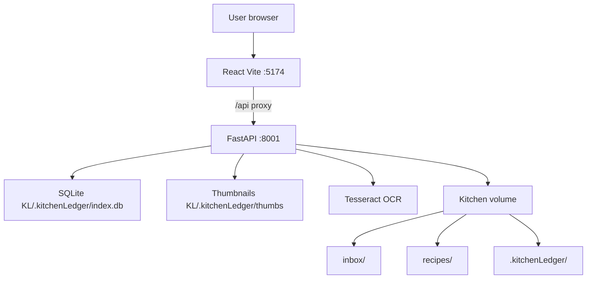
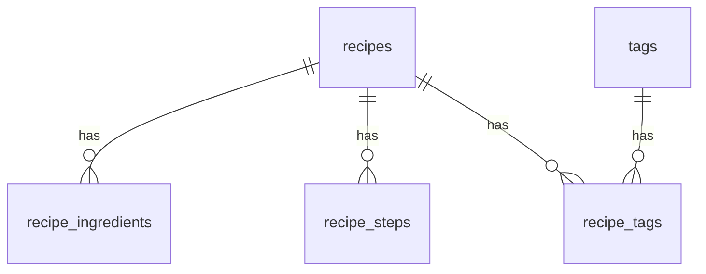

# Kitchen Ledger — Architecture

Local-first web app for cataloging scanned handwritten recipes: inbox scan, OCR-assisted drafts, editable ingredients/directions, and multi-tag AND filtering.

## Design principles

- **Scan from disk** — drop images into `inbox/`; no HTTP upload.
- **OCR is a draft** — Tesseract pre-fills ingredients/directions; handwriting is expected to need correction.
- **Co-located catalog** — SQLite + thumbs live under `{KL_ROOT}/.kitchenLedger` so the library can move with the media.
- **Single machine** — no auth; intended for localhost or LAN.

## System context

In Docker, the frontend proxies `/api` to the backend. Host kitchen media is mounted via `KL_HOST_PATH` → `/media`. Compose publishes host ports **8001** (API) and **5174** (UI) so Image Organizer can keep 8000/5173. `docker-compose.yml` hardcodes container `KL_ROOT=/media` and `KL_DATA_DIR=/media/.kitchenLedger`; only `KL_HOST_PATH` is interpolated from the host `.env` (avoids a host-shell `KL_ROOT` leaking into the container).

## Tech stack

| Layer | Choice |
|-------|--------|
| Backend | Python 3.12, FastAPI, SQLite, Pillow, pytesseract |
| Frontend | React 18, TypeScript, Vite, TanStack Query, react-router |
| OCR | System `tesseract-ocr` |
| Deploy | Docker Compose |

Interactive API: `http://localhost:8001/docs` (container listens on `:8000`; Compose publishes host `:8001`).

## Repository layout

### Backend (`backend/app/`)

| Module | Responsibility |
|--------|----------------|
| `main.py` | HTTP routes, CORS, startup `init_db` |
| `db.py` | SQLite schema, connection, config key-value store |
| `models.py` | Pydantic request/response models |
| `config.py` | Paths, extensions, env vars |
| `scanner.py` | Background inbox scan + OCR pre-fill |
| `ocr.py` | Tesseract extract + naive ingredient/step split |
| `metadata.py` | Image dims, SHA256, thumbnails, slugify |
| `recipes.py` | Recipe list/get/update, ingredients/steps replace |
| `tags.py` | Tag CRUD, merge, assign, cooccurring |
| `db_backup.py` | Online SQLite backup API |

### Frontend (`frontend/src/`)

| Area | Responsibility |
|------|----------------|
| `api/client.ts` | Typed fetch wrapper for `/api/*` |
| `pages/` | Home, Inbox, Recipes, RecipeDetail, Tags, Settings |
| `App.tsx` | Sidebar shell and routes |

## Data model

SQLite schema in `backend/app/db.py`, applied on startup via `init_db()`.

On `init_db()`, if stored `inbox_path` / `recipes_path` are missing on disk but the env-derived defaults exist, those defaults are written back into `config`. That keeps Docker usable after a local (host-path) run shared the same catalog volume.

| Table | Purpose |
|-------|---------|
| `recipes` | Indexed scan (`status`: `draft` \| `reviewed`), title, notes, OCR text, image path |
| `recipe_ingredients` | Ordered ingredient lines |
| `recipe_steps` | Ordered direction lines |
| `tags` | Labels (`name`, unique `slug`) |
| `recipe_tags` | Recipe ↔ tag many-to-many |
| `config` | Inbox/recipes path overrides |

Multi-tag AND filter on `GET /api/recipes` uses repeated `tag_id` query params.

## Filesystem layout

| Path | Role |
|------|------|
| `{KL_ROOT}/inbox/` | Drop scanned recipe images |
| `{KL_ROOT}/recipes/` | Reserved for organized copies (future) |
| `{KL_DATA_DIR}/` | Catalog (default `{KL_ROOT}/.kitchenLedger`): `index.db`, `thumbs/`, `backups/` |

Env:

- `KL_HOST_PATH` — host folder mounted at `/media` in Compose (the main Docker setting)
- `KL_ROOT` — kitchen root inside the process (Compose hardcodes `/media`; used for local non-Docker runs)
- `KL_DATA_DIR` — catalog (Compose hardcodes `/media/.kitchenLedger`; default `{KL_ROOT}/.kitchenLedger` locally)

Supported images: JPEG, PNG, HEIC, WebP, TIFF.

## Core workflows

### 1. Scan

1. User drops images into inbox → clicks **Scan** (`POST /api/scan`).
2. Background thread walks inbox, upserts `recipes`, generates thumbnails.
3. New/changed files without `ocr_text` run Tesseract; lines are split into candidate ingredients/steps.
4. Status via `GET /api/scan/status` (`phase`: `scanning` → `pruning` → `ocr` → `idle`).
5. Missing files under the inbox path are pruned from the DB.

### 2. Review draft

1. Inbox lists `status=draft` recipes.
2. Detail page shows the scan beside editable fields.
3. User corrects OCR, adds tags, saves, and optionally **Mark reviewed**.

### 3. Browse and filter

1. Recipes page: search (`q`) over title, notes, source, ingredients, steps.
2. Multi-tag AND via repeated `?tag=` slugs (resolved to `tag_id`s).
3. Co-occurring tags sidebar from `GET /api/tags/cooccurring`.

## API overview

| Group | Endpoints |
|-------|-----------|
| Health | `GET /api/health` |
| Config | `GET/PATCH /api/config` |
| Scan | `POST /api/scan`, `GET /api/scan/status` |
| Recipes | `GET /api/recipes`, `GET/PATCH /api/recipes/{id}`, `PUT .../ingredients`, `PUT .../steps` |
| Media | `GET /api/recipes/{id}/thumbnail`, `GET /api/recipes/{id}/image` |
| Tags | CRUD, merge, assign/unassign-ids, cooccurring |
| Backup | `POST /api/database/backup`, `GET /api/database/backups` |

## Frontend routes

| Route | Page |
|-------|------|
| `/` | Home — recent recipes + scan |
| `/inbox` | Draft recipes + scan status |
| `/recipes` | Browse/search + multi-tag filter |
| `/recipes/:id` | Detail editor (image + transcription) |
| `/tags` | Tag catalog |
| `/settings` | Paths + DB backup |

## Versioning

Date-based releases: `YYYY.MM.DD`. Notes in [CHANGELOG.md](../CHANGELOG.md); version strings in `frontend/package.json` and FastAPI `main.py`.

## Keeping this document current

Update **this file** in the same change when you modify schema, API route groups, frontend routes/workflows, Docker volumes/env, or core module responsibilities. Cursor agents: see `.cursor/rules/architecture-doc.mdc`.
